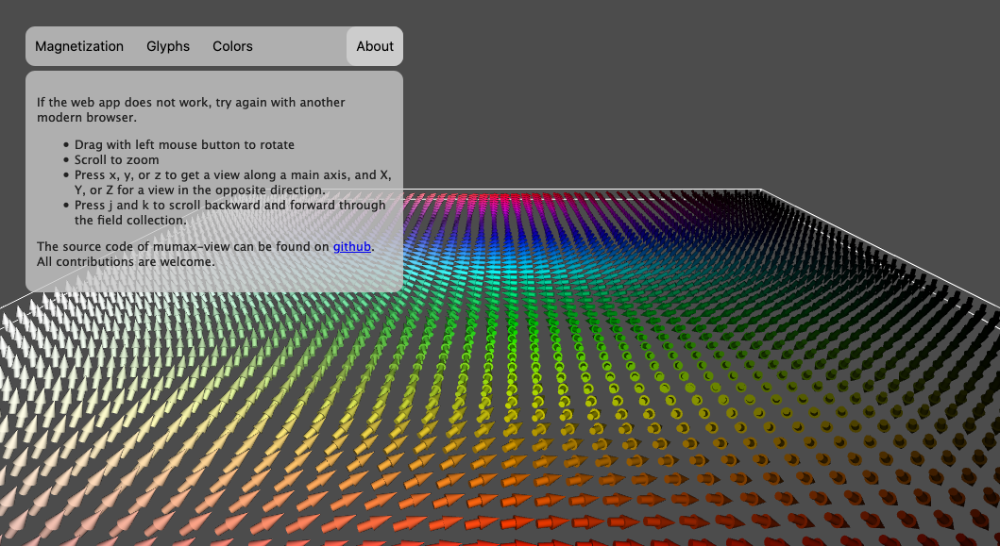

# MUMAX-VIEW IN DOCKER



Mumax-view is an application developed by [Jeroen Mulkers](https://github.com/JeroenMulkers/mumax-view), this amazing piece of software visualizes the OVF files created from Mumax3 onto a web page or a desktop application.

This docker image uses the web interface provided by mumax-view to show the OVF file, as the docker image does not have GUI.

## Fast setup
Pull the image from dockerhub:

```
$ docker pull sergiomtzlosa/mumax-view
```
Then run the image:

```
$ docker run -d -p 5670:80 sergiomtzlosa/mumax-view 
```
Open your browser pointing the following URL: **http://YOUR_IP:5670/mumax-view/**

Then you will see the mumax-view example, you can upload your OVF files to visualize them.

## Build docker image from source
The build process should be straightforward:

1 .-Pull the code:
```
$ git clone git@github.com:sergiomtzlosa/docker-mumaxview.git
```
2.- Build the image
```
$ docker-compose up -d
```
Open your browser pointing the following URL: **http://YOUR_IP:5670/mumav-view/**

## Dockerhub link

[https://hub.docker.com/r/sergiomtzlosa/mumax-view](https://hub.docker.com/r/sergiomtzlosa/mumax-view)
